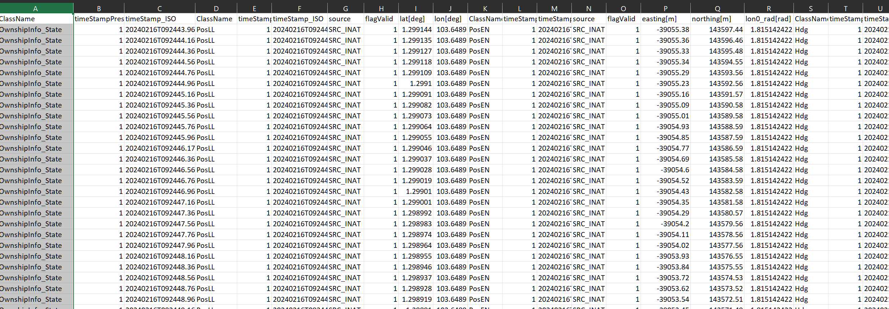

## Requirements
1. Python (I am using Python 3.11.9)
2. Input data file. A csv file that stores log from of OwnshipInfo Server
Csv file should contain all of OwnshipInfo state like the following image

## Dependencies
1. python-dotenv
   `pip install python-dotenv`
2. pandas
    `pip install pandas`

## Run
- Change the INPUT_FILE inside .env to the directory of the csv log file.
- Name output files.
- `cd your-path-to-the-script`
- `python csv_to_dat.py`